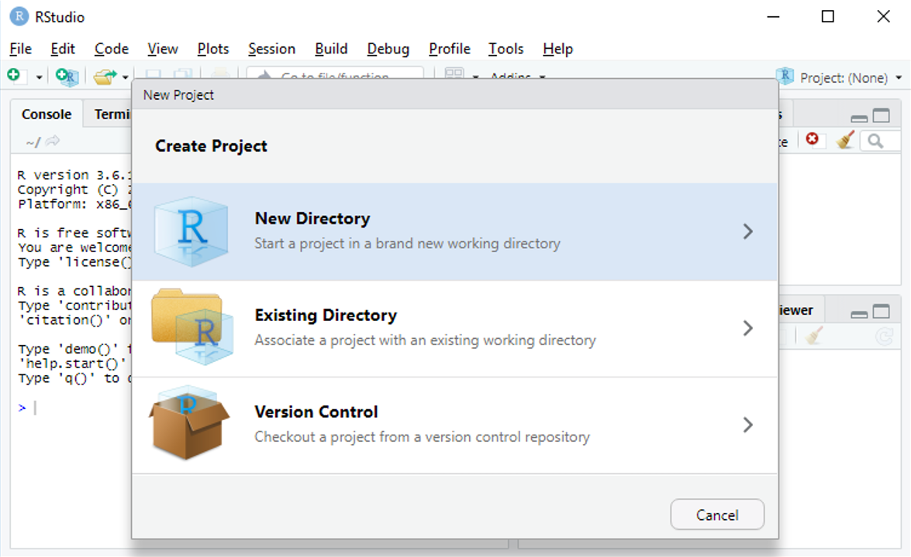

```{r setup, include=FALSE}
knitr::opts_chunk$set(echo = TRUE)
```

## But

Ce document est un aide-mémoire pour réussir l'importation des données dans R. En suivant les différentes étapes, tout devrait bien se passer.

L'objectif sera donc ici d'importer le jeu de données stockés dans le fichier Excel  [samares](datasets/samares_small.xlsx) disponible sur la page des [données](data.html)

## Etape 1. Créer un projet 

Rstudio proposer d'organiser son travail en projet. Le projet permet de faciliter l'accès aux différents fichiers d'un même projet. 
Pour créer un projet il suffit d'aller en haut à droite, dans Project comme dans la capture d'écran ci-dessous.

{ width=90% }

On choisit de créer le projet depuis un nouveau répertoire

{ width=90% }

et de  faire un projet standard 

{ width=90% }

qui s'appelera Td_Stat_1 et sera placé dans le répertoire désigné

{ width=90% }


## Etape 2. Télécharger le fichier

Le fichier est disponible sur la page des [jeux de données ](data.html)

On peut le sauvegarder sur le disque en faisant un clic droit et en choisissant 'Save as' ( ou 'Sauvegarder la cible du lien sous' ou tout autre formulation similaire). On choisit de le sauver dans le répertoire du projet qu'on vient de créer précédemment.


## Etape 3. D'un format propriétaire à un format texte

Le format Excel est complexe et varie d'une plateforme à l'autre, d'une langue à l'autre .... Pour éviter les surprises, il est préférable d'exporter son fichier au format  `csv`. Dans Excel, il suffit d'aller dans le menu File puis Save as et de choisir l'extension csv dans le menu déroulant des types de fichier puis de le sauver dans le répertoire du projet  sous le nom `samares_small.csv'. On a donc un fichier `samares_small.csv' dans le répertoire du projet.


## Etape 4.  Comprendre le format du fichier de données

En ouvrant le fichier `samares_small.csv' avec un éditeur de texte (Notepad++ sous Windows, gedit sous Linux,  TextWrangler sous Mac OS par exemple), on peut voir le fichier brut et le début doit ressembler à~:


```{r, eval = FALSE}
Etude d’une potentielle sélection génétique sur les capacités de dispersion du frêne,,,,,,,,,,
Données partielles,,,,,,,,,,
Source : perdue ,,,,,,,,,,
Site,NomSite,Distance,Arbre,Poids,Surface,Largeur,Longueur,CircArbre,dispersion,log_disp
1,Grenou_1,0,1,16.8,0.83907,0.45758,2.46212,57,0.049944642857143,-2.99684002974653
1,Grenou_1,0,1,25.4,0.80864,0.43251,2.47986,57,0.031836220472441,-3.4471506288068
1,Grenou_1,0,1,21.7,0.77436,0.44081,2.35872,57,0.035684792626728,-3.3330306577928
1,Grenou_1,0,1,14.9,0.86005,0.45292,2.63522,57,0.057721476510067,-2.85212596484115
1,Grenou_1,0,1,21,0.81353,0.46885,2.41978,57,0.038739523809524,-3.25089491303743
1,Grenou_1,0,1,20.1,0.82752,0.46522,2.40977,57,0.041170149253731,-3.19004181790373
1,Grenou_1,0,1,26.8,0.98631,0.48447,2.68182,57,0.036802611940299,-3.30218645968743
1,Grenou_1,0,1,21.4,0.87054,0.45428,2.71523,57,0.040679439252337,-3.20203249225429
1,Grenou_1,0,1,18.9,0.83487,0.42868,2.7107,57,0.044173015873016,-3.11964117694036
```

Le fichier est construit de la manière suivante 

 - 3 lignes de commentaires, 
 - une ligne qui indique le nom des colonnes, puis les données elles-mêmes
 - le changement de colonnes est matérialisé par une virgule. 
  
Nous allons donc expliquer ceci à R.

## Etape 5 :  importation dans R

L'importation dans R se fait à l'aide  de la commande `read.table`. On ouvre donc un nouveau script (File -> New File -> Rscript). En haut du script, on indique la date, et le but de l'analyse en faisant précéder les débuts de lignes par des `#`.

```{r, eval = FALSE}
## le 19 septembre 2019 
## Tutoriel pour apprendre à importer un fichier de données dans R
```


Les lignes qui commencent par `#` ne sont pas interprétées par R, elles permettent de faire des commentaires.


```{r, echo = FALSE}
dta <- read.table(file = 'datasets/samares_small.csv', sep = ',', skip = 3, header = TRUE)
```


```{r, eval = FALSE}
dta <- read.table(file = 'samares_small.csv', ## le nom du fichier qu'on souhaiote lire
                  skip = 3,  ## pour dire à R d'ignorer les 3 premières lignes de commentaires
                  header = TRUE,  ## pour indiquer que les colonnes ont un nom 
                  sep = ',' ## pour indiquer que le séparateur de collones est une virgule
                  ) 
```

Normalement R n'indique aucune erreur.

## Etape 6. Vérifier l'importation

On doit voir apparaître dans l'onglet environnement un nouveau jeu de données `dta`. Il est indiqué qu'il a 120 observations (i.e. 120 lignes dans le jeu de données) et 11 variables (11 colonnes dans le jeu de données).

On peut faire afficher les premières lignes pour vérifier qu'elles sont correctes

```{r}
head(dta)
```

ou les dernières

```{r}
tail(dta)
```

On peut aussi demander un résumé du jeu de données qui va nous aider à vérifier que l'importation s'est bien déroulée.

```{r}
summary(dta)
```

Normalement Les variables quantitatives sont résumées quantitativement par le minimum, le premier quartile, la médiane, etc .... Tandis que les variables qualitatives sont interprétées comme des facteurs et sont résumées par le nombre d'occurences de chaque niveau du facteur.

Si toutes les vérifications sont correctes, votre jeu de données est prêt à être analysé.

## Etape 7. Quand ça va mal

### Si il n'y a pas de noms de colonnes

Il suffit d'indiquer `header = FALSE`, dans ce cas les colonnes seront nommées `V1`, `V2`, etc 

### Les différents types de séparateurs

Si le séparateur de colonnes  n'est pas la `,`, alors il faut modifier l'argument `sep`


|  Séparateur  	|  sep =   	|
|:-:	|:-:	|
|   ,	| sep = ','  	|
|   ;	| sep = ';'  	|
|   espace 	| sep = ' '  	|
|  tab	|   sep = '\t'	|


### Problème possible avec les variables numériques

Il est possible avec une version française d'Excel, que le symbole qui code pour la décimale ne soit pas le `.` qui est la convention internationale mais le `,` qui est l'habitude Française. Si on ne l'indique pas à R, il ne va pas comprendre que la variable concernée est quantitative. Ceci sera visible dans le résumé de la variable. Si tel est le cas, il suffit de rajouter l'argument `dec = ',' ` dans la fonction `read.table` (à n'importe quel endroit ). 

```{r wrong_dec_show, eval = FALSE}
dta_wrong <- read.table(file = 'samares_small.csv', ## le nom du fichier qu'on souhaiote lire
                  skip = 3,  ## pour dire à R d'ignorer les 3 premières lignes de commentaires
                  header = TRUE,  ## pour indiquer que les colonnes ont un nom 
                  sep = ',', ## pour indiquer que le séparateur de collones est une virgule
                  dec = ','
                  ) 
```

```{r wrong_dec_hide, echo = FALSE}
dta_wrong <- read.table(file = 'datasets/samares_small.csv', ## le nom du fichier qu'on souhaiote lire
                  skip = 3,  ## pour dire à R d'ignorer les 3 premières lignes de commentaires
                  header = TRUE,  ## pour indiquer que les colonnes ont un nom 
                  sep = ',', ## pour indiquer que le séparateur de collones est une virgule
                  dec = ','
                  ) 
```

Ici, puisque le signe de décimal était un point `.` mais qu'on lui indique le contraire, on reprère justement un problème lorsqu'on demande un résumé des données. 

```{r wrong_dec_sum}
summary(dta_wrong)
```


