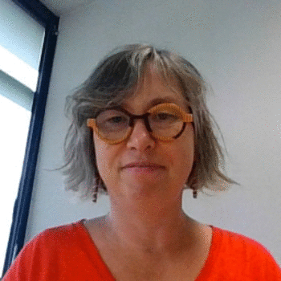

```{r setup_teaching, include=FALSE}
knitr::opts_chunk$set(echo = TRUE, cache = TRUE)
```


 </img>
  
  

  

I am currently Associate Professor at [ENSAI](https://ensai.fr/),  on leave from [Institut Agro Renens Angers](https://www.institut-agro-rennes-angers.fr/)  where I arrived in 2017.

I'm specialized in the development of statistical methods for ecology and I enjoy working with people from different background: statisticians, ecologists, fisheries scientists, ...
You will find more details on the research section.

As Associate Professor, I spend some time at teaching to students and professionnals at different levels and I love that! Please visit the teaching section to find teaching materials as well as useful links. I also teach R and statistics during continuing education sessions. 
 
  
  
## Contact information
- <i class="fas fa-map-marker"></i> CREST </br>
  ENSAI, </br>
  51 Rue Blaise Pascal,</br>
BP 37203 – 35172 BRUZ Cedex,</br>
FRANCE

- <i class="fa fa-phone"></i> +33 (0)2 99 05 32 19

- <i class="fa fa-at"></i> <a href="mailto:marie-pierre.etienne@ensai.fr">marie-pierre [dot] etienne [at] ensai [dot] fr</a>


 

 


